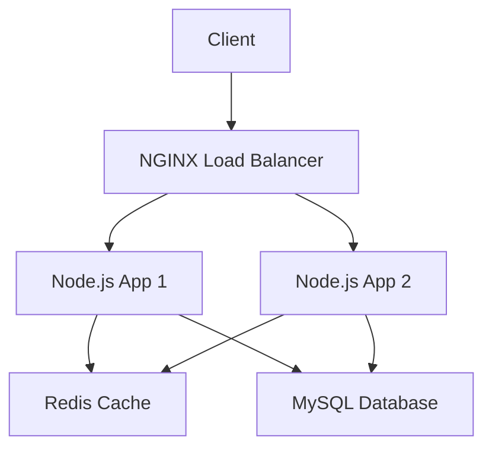

```markdown
# Vagrant Multi-Tier Web Application Infrastructure (NGINX + Node.js + Redis + MySQL)


A complete virtualized development environment simulating a production-ready web application infrastructure with:
- NGINX load balancer
- Multiple Node.js application servers
- Redis caching layer
- MySQL database server

## 📦 Prerequisites

Before you begin, ensure you have the following installed:
- [Vagrant](https://www.vagrantup.com/) (>= 2.2.0)
- [VirtualBox](https://www.virtualbox.org/) (>= 6.0)
- 8GB+ RAM (16GB recommended)
- 20GB+ free disk space

## 🚀 Quick Start

1. Clone this repository:
   ```bash
   git clone https://github.com/mohamedfawzizaki/e2e-devops-vagrant-3tier.git
   cd e2e-devops-vagrant-3tier
   ```

2. Start the virtual infrastructure:
   ```bash
   vagrant up
   ```
   (Go grab some coffee - this will take a while ☕)

3. Access the application:
   - Load Balancer: http://192.168.56.10
   - Node.js App Servers: http://192.168.56.13:3000, http://192.168.56.14:3000 from inside Load Balancer Vm
   - Redis CLI: `vagrant ssh rds-server` then `redis-cli`
   - MySQL: `vagrant ssh db-server` then `mysql -u root`

## 🌐 Infrastructure Overview



### Virtual Machines Details

| Component        | VM Name            | IP Address    | Hostname     | Ports |
|------------------|--------------------|---------------|--------------|-------|
| NGINX LB         | loadbalancer-nginx | 192.168.56.10 | loadbalancer | 80    |
| Node.js App 1    | nodejs-1           | 192.168.56.13 | nodejs1      | 3000  |
| Node.js App 2    | nodejs-2           | 192.168.56.14 | nodejs2      | 3000  |
| Redis Cache      | rds-server         | 192.168.56.11 | redis        | 6379  |
| MySQL Database   | db-server          | 192.168.56.12 | mysql        | 3306  |

## 🛠️ Provisioning Details

Each VM is provisioned with specific setup scripts:

- **NGINX Load Balancer**:
  - Installs NGINX
  - Configures load balancing across Node.js servers
  - Sets up health checks

- **Node.js Servers**:
  - Installs Node.js 16.x
  - Sets up PM2 process manager
  - Deploys sample application
  - Configures connection to Redis and MySQL

- **Redis Server**:
  - Installs Redis 6.x
  - Configures persistence
  - Sets up proper security

- **MySQL Server**:
  - Installs MySQL 8.0
  - Creates sample database and user
  - Configures basic security settings

## 📂 Directory Structure

```
.
├── README.md               # This file
├── Vagrantfile             # Main Vagrant configuration
├── scripts/
│   ├── provision_ngx.sh    # NGINX setup script
│   ├── provision_app.sh    # Node.js app setup
│   ├── provision_rds.sh    # Redis setup
│   └── provision_db.sh     # MySQL setup
└── sync-directories/
    ├── app/                # Node.js application code
    └── nginx/              # NGINX configuration files
```

## 🧹 Maintenance Commands

| Command                     | Description                                  |
|-----------------------------|----------------------------------------------|
| `vagrant up`                | Starts all VMs                              |
| `vagrant halt`              | Stops all VMs                               |
| `vagrant destroy -f`        | Deletes all VMs (⚠️ Destructive!)          |
| `vagrant ssh <vm-name>`     | SSH into specific VM                        |
| `vagrant provision`         | Re-run provisioning scripts                 |
| `vagrant status`            | Show current VM states                      |

## 🧪 Testing the Infrastructure

1. Verify load balancing:
   ```bash
   curl http://192.168.56.10
   ```
   (Repeat multiple times to see requests distributed to different Node.js servers)

2. Test Redis caching:
   ```bash
   vagrant ssh rds-server
   redis-cli ping  # Should return "PONG"
   ```

3. Verify database connection:
   ```bash
   vagrant ssh db-server
   mysql -u root -e "SHOW DATABASES;"
   ```

## 🐛 Troubleshooting

- **Vagrant up fails**: 
  - Ensure virtualization is enabled in BIOS
  - Check for sufficient disk space
  - Verify network connectivity for package downloads

- **Port conflicts**:
  - Check if ports 80, 3000, 3306, or 6379 are in use on host machine

- **Provisioning errors**:
  - Run `vagrant provision` to retry
  - Check logs in `/var/log/` on respective VMs

## 🤝 Contributing

1. Fork the project
2. Create your feature branch (`git checkout -b feature/AmazingFeature`)
3. Commit your changes (`git commit -m 'Add some AmazingFeature'`)
4. Push to the branch (`git push origin feature/AmazingFeature`)
5. Open a Pull Request


## 📧 Contact

Mohamed Fawzi Zaki - mohamedfawzizaki@gmail.com

Project Link: [https://github.com/yourusername/vagrant-multi-tier-app](https://github.com/yourusername/vagrant-multi-tier-app)
```